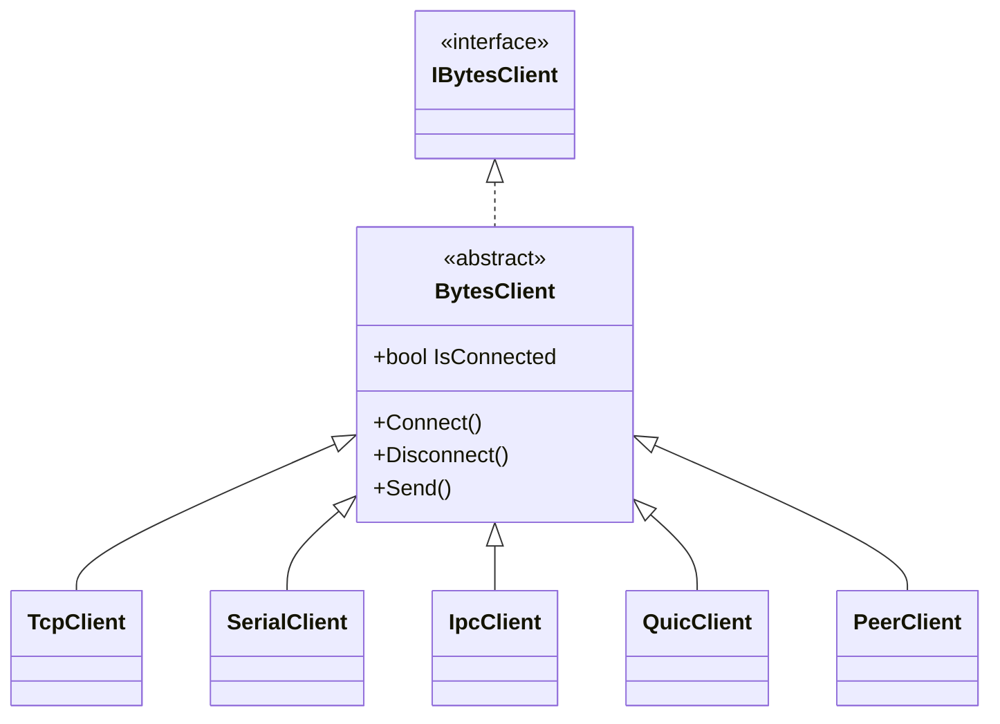

# 会一种，就等于会了所有：BytesIO 通信客户端横向对比与统一设计

在开发物联网（IoT）、工业控制或网络通信系统时，经常需要处理多种通信物理通道：比如在局域网内用 **TCP**，与本地硬件用 **串口 (SerialPort)**，进程间通信用 **命名管道 (IPC)**，高可靠广域网用 **QUIC**，而节点间直连则用 **P2P**。

传统开发中，每种通信协议都有各自独特的类库和 API（如 `TcpClient`、`SerialPort` 等），开发者需要为每种通道编写截然不同的处理逻辑。

`STTech.BytesIO` 彻底解决了这一痛点。它的核心设计理念是：**“让不同的通信方式变得一样简单”**。

通过将所有通信客户端统一抽象为 `BytesClient`，BytesIO 实现了 **API 的完全一致性**。这意味着：**你只要学会了其中一种客户端的用法，就等于掌握了所有通信方式的开发。**

### 架构继承图关系


---

## 1. 各种 Client 实例化与配置对比

不同通信方式的差异，仅仅体现在**初始化**和**特定物理参数配置**上，一旦对象被创建出来，后续的操作接口就完全相同。

下面是 BytesIO 支持的主要客户端实例化代码的横向对比：

### TCP 客户端
```csharp
using STTech.BytesIO.Tcp;

var client = new TcpClient()
{
    Host = "127.0.0.1",
    Port = 60000
};
```

### 串口客户端 (标准 .NET Ports)
```csharp
using STTech.BytesIO.Serial;

var client = new SerialClient()
{
    PortName = "COM1",
    BaudRate = 115200,
    ReceiveBufferSize = 65536,
    SendBufferSize = 65536
};
```

### 串口客户端 (基于高速 RJCP 驱动)
如果你追求极致的串口稳定性和吞吐，仅需在 `SerialClient` 后链式调用 `.UseSerialPortStream()`，即可无缝切换底层驱动，而上层 API 保持不变：
```csharp
using STTech.BytesIO.Serial;
using STTech.BytesIO.SerialPortStream; // 引入 RJCP 扩展

var client = new SerialClient()
{
    PortName = "COM1",
    BaudRate = 115200,
    ReceiveBufferSize = 65536,
    SendBufferSize = 65536
}.UseSerialPortStream();
```

### IPC (进程间通信/命名管道) 客户端
```csharp
using STTech.BytesIO.Ipc;

var client = new IpcClient()
{
    PipeName = "STTech.BytesIO.Demo"
};
```

### QUIC 客户端
```csharp
using STTech.BytesIO.Quic;

var client = new QuicClient()
{
    Host = "127.0.0.1",
    Port = 443
};
```

### P2P 客户端
```csharp
using STTech.BytesIO.P2P;

var client = new PeerClient()
{
    // 配置 P2P 的远端节点凭证或局域网发现参数
};
```

---

## 2. 统一的公共 API 规范

所有上述客户端都继承自 `BytesClient` 并实现了 `IBytesClient` 接口。它们共享完全相同的属性、方法和事件：

### 核心属性
- **`IsConnected`** (`bool`)：指示当前物理通道是否已成功建立连接。
- **`ConnectionId`** (`string`)：当前会话的唯一标识，每次重连都会自动刷新，便于在日志中诊断生命周期。
- **`ReceiveBufferSize` / `SendBufferSize`** (`int`)：接收和发送缓冲区大小限制。

### 统一的控制方法
- **`Connect()` / `ConnectAsync()`**：发起连接。支持传入超时时间或高级连接参数。
- **`Disconnect()` / `DisconnectAsync()`**：断开物理连接。
- **`Send(byte[])` / `SendAsync(byte[])`**：向远端发送原始字节流。

### 统一的生命周期事件
- **`OnConnectedSuccessfully`**：当通道建立物理连线并握手成功时触发。
- **`OnConnectionFailed`**：当发起连接由于超时、拒绝等原因失败时触发。
- **`OnDisconnected`**：当物理通道意外断开或主动关闭时触发。
- **`OnDataReceived`**：当物理层收到数据时触发，接收到的数据完全被包装在 `ReceiveContext` 中。
- **`OnDataSent`**：当客户端成功将数据推送到发送管道时触发。
- **`OnExceptionOccurs`**：当物理传输层发生内部异常时触发。

---

## 3. 面向抽象编程的强大优势

由于所有通信方式都实现了相同的接口，你可以编写出**与物理通信通道无关的通用业务逻辑**。

以下示例展示了如何编写一个通用的“连接-发送-接收”业务控制器，它可以接受任何通信客户端（TCP、串口、管道等）并直接工作：

```csharp
using System;
using System.Text;
using System.Threading.Tasks;
using STTech.BytesIO.Core;

public class 通用业务控制器
{
    private readonly BytesClient _client;

    // 构造函数接收 BytesClient 基类，实现了物理通道的完全解耦
    public 通用业务控制器(BytesClient client)
    {
        _client = client;

        // 1. 统一订阅事件
        _client.OnConnectedSuccessfully += Client_OnConnectedSuccessfully;
        _client.OnDisconnected += Client_OnDisconnected;
        _client.OnDataReceived += Client_OnDataReceived;
    }

    public async Task StartWorkflowAsync()
    {
        Console.WriteLine($"准备连接物理通道。当前会话 ID: {_client.ConnectionId}");

        // 2. 统一的连接调用
        var result = await _client.ConnectAsync(timeout: 5000);
        if (result.IsSuccess)
        {
            Console.WriteLine("通道已就绪，正在发送初始化指令...");

            // 3. 统一的数据发送
            byte[] initCmd = new byte[] { 0x01, 0x02, 0x03 };
            await _client.SendAsync(initCmd);
        }
        else
        {
            Console.WriteLine($"连接失败，原因: {result.ErrorCode}");
        }
    }

    private void Client_OnConnectedSuccessfully(object sender, ConnectedSuccessfullyEventArgs e)
    {
        Console.WriteLine($"[物理连线成功] 连接时间: {e.ConnectedTime}");
    }

    private void Client_OnDisconnected(object sender, DisconnectedEventArgs e)
    {
        Console.WriteLine($"[通道断开] 会话持续时间: {e.Duration}");
    }

    private void Client_OnDataReceived(object sender, DataReceivedEventArgs e)
    {
        // 4. 统一的接收处理 (ReceiveContext)
        // 使用零分配扩展将数据转换为十六进制字符串
        Console.WriteLine($"[物理层收到报文] Hex: {e.Data.ToHexString()}");
    }
}
```

### 业务层的无缝切换
得益于面向抽象（`BytesClient`）的设计，如果你的系统原来是在网口（TCP）上运行，现在需要修改为运行在物理串口（COM3）上，你的**整个业务层代码和控制器完全不需要做任何修改**，在初始化时使用多态特性声明基类即可：

```csharp
// 运行于 TCP 网络环境
BytesClient client = new TcpClient() { Host = "192.168.1.100", Port = 5000 };
var controller = new 通用业务控制器(client);

// ============================================
// 一键切换至串口环境，控制器与后续业务逻辑完全不用动！
// ============================================
BytesClient client = new SerialClient() { PortName = "COM3", BaudRate = 9600 };
var controller = new 通用业务控制器(client);
```

---

## 4. 总结：这样做的好处

1. **学习成本降低到极限**：开发者只需熟悉一遍 `Connect`、`Send` 和 `OnDataReceived`，就能驾驭 TCP、串口、Quic、命名管道和 P2P 通信，不需要为每种通信协议查阅不同的微软类库。
2. **极高的代码重用度**：上层的解包器（`Unpacker`）、心跳发送器、重连插件、通信日志插件全都是针对 `BytesClient` 基类编写的，这使得所有这些强力工具能自动应用于 TCP、串口和管道，实现真正的一次编写，到处复用。
3. **极佳的系统可扩展性**：若未来需要支持全新的物理介质（例如无线 LoRa 模块或蓝牙），只需根据 `BytesClient` 契约封装一个自定义 Client，已有的解包、重连和业务应用就能原封不动地移植过去。
