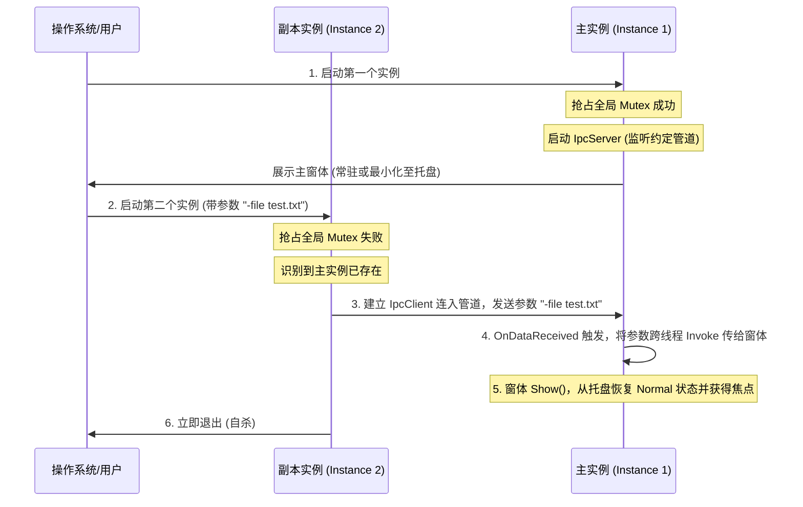

# 命名管道 IPC 通信快速上手与单实例唤醒实战

在开发桌面应用程序或本地服务时，我们经常需要在**同一个操作系统内的不同进程之间**传递数据。这种机制被称为**进程间通信（IPC, Inter-Process Communication）**。

`STTech.BytesIO` 提供了基于 **命名管道（Named Pipes）** 的 IPC 实现，包含 `IpcClient` 和 `IpcServer` 两个主要核心类。

本教程将详细介绍 BytesIO IPC 库的特点、快速上手代码，以及如何利用它构建一个**支持进程单实例运行、启动参数传递与窗口激活唤醒**的典型桌面应用。

---

## 1. BytesIO IPC 库的特点

BytesIO 的 IPC 模块完美融入了框架的统一接口设计，这带来了两个核心特点：

- **客户端用法完全一致**：`IpcClient` 继承自 `BytesClient`。它与 `TcpClient` 或 `SerialClient` 的调用方式 100% 相同。开发过 TCP 或串口客户端的工程师可以**零成本**编写 IPC 客户端代码。
- **服务端设计非常相似**：`IpcServer` 继承自 `BytesServer<IpcClient>`，其管理连接、接收数据和分发数据的编程模型与 `TcpServer` 非常相似。它支持管理在线客户端列表，并统一捕获客户端的连接、断开和异常事件。

---

## 2. 快速上手示例代码

### 2.1 IPC 服务端 (IpcServer) 示例

服务端负责创建并监听一个特定名称的管道，并接收所有连入的客户端发送的数据：

```csharp
using System;
using System.Text;
using STTech.BytesIO.Core;
using STTech.BytesIO.Ipc;

// 1. 实例化 IpcServer 并指定管道名称 (PipeName)
// 管道名称在同一台机器上必须是唯一的，用于客户端定位连接
var server = new IpcServer()
{
    PipeName = "STTech.BytesIO.TutorialPipe"
};

// 2. 订阅客户端连入事件
server.ClientConnected += (sender, e) =>
{
    // 获取当前连入的客户端对象 (IpcClient)
    IpcClient connectedClient = e.Client;
    Console.WriteLine($"[服务端提示]: 客户端已连接，会话ID: {connectedClient.ConnectionId}");

    // 3. 在客户端对象上订阅数据接收事件
    connectedClient.OnDataReceived += (clientSender, dataArgs) =>
    {
        // 提取数据内容并以 UTF-8 格式解码
        string message = dataArgs.Data.EncodeToString(Encoding.UTF8);
        Console.WriteLine($"[服务端收到数据]: {message}");

        // 回复客户端收到消息
        byte[] replyBytes = Encoding.UTF8.GetBytes($"[服务器回执] 收到数据: {message}");
        connectedClient.Send(replyBytes);
    };

    // 订阅客户端断开事件
    connectedClient.OnDisconnected += (clientSender, disconnectArgs) =>
    {
        Console.WriteLine($"[服务端提示]: 客户端已断连，会话ID: {connectedClient.ConnectionId}");
    };
};

// 4. 启动服务端监听 (异步非阻塞)
await server.StartAsync();
Console.WriteLine("IPC 服务端已启动监听...");

// 保持控制台运行
Console.ReadLine();

// 5. 退出时安全关闭服务端并释放资源
await server.CloseAsync();
server.Dispose();
```

---

### 2.2 IPC 客户端 (IpcClient) 示例

客户端通过管道名称连接到正在运行的服务端，向其发送消息并接收回执：

```csharp
using System;
using System.Text;
using STTech.BytesIO.Core;
using STTech.BytesIO.Ipc;

// 1. 实例化 IpcClient 并指定目标管道名称
var client = new IpcClient()
{
    PipeName = "STTech.BytesIO.TutorialPipe"
};

// 2. 订阅数据接收事件 (接收服务端发回的回执数据)
client.OnDataReceived += (sender, e) =>
{
    string reply = e.Data.EncodeToString(Encoding.UTF8);
    Console.WriteLine($"[客户端收到回执]: {reply}");
};

// 3. 建立物理管道连接 (同步或异步均可)
var connectResult = await client.ConnectAsync();
if (connectResult.IsSuccess)
{
    Console.WriteLine("成功连接到 IPC 服务端！");

    // 4. 传输数据
    byte[] sendBuffer = Encoding.UTF8.GetBytes("Hello, BytesIO IPC!");
    await client.SendAsync(sendBuffer);
}
else
{
    Console.WriteLine($"连接失败: {connectResult.ErrorCode}");
}

Console.ReadLine();

// 5. 退出时断开并释放客户端
await client.DisconnectAsync();
client.Dispose();
```

---

## 3. 实战应用：单实例桌面应用激活与传参

在实际的桌面应用程序（如音乐播放器、文档编辑器等）中，为了防止重复启动造成资源浪费，我们通常要求程序**只运行一个实例（单实例运行）**。

当用户再次点击 exe 或通过双击关联文件启动第二个实例时，我们的预期行为是：**第二个实例立刻把启动参数发送给正在运行的第一个实例，然后自杀；第一个实例在收到参数后，自动从系统托盘中唤醒，弹向屏幕最前端，并在界面上显示或处理这些参数。**

这套经典逻辑正是利用 **系统 Mutex + IPC 命名管道** 共同实现的。

---

## 4. `ActivateAppByIPC` 示例程序工作逻辑

在 `STTech.BytesIO` 的演示项目中，我们设计并构建了 `STTech.BytesIO.Demo.ActivateAppByIPC` 这个 Demo。它的核心工作逻辑图示如下：



---

## 5. 关键源码引用与 IPC 用法分析

我们来深入研读 `ActivateAppByIPC` 内部关于单实例和 IPC 交互的黄金实现：

### 5.1 Program.cs 核心引导逻辑
`Program.cs` 内部完成了 Mutex 互斥检测与客户端/服务端的逻辑分流：

```csharp
// Program.cs 节选
static class Program
{
    private static Mutex? mutex = null;
    private const string MutexName = "Global\\STTech.BytesIO.Demo.ActivateAppByIPC.Mutex";
    private const string PipeName = "STTech.BytesIO.Demo.ActivateAppByIPC.Pipe";

    [STAThread]
    static void Main(string[] args)
    {
        // 1. 使用系统全局 Mutex 检测是否已有实例在运行
        bool createdNew;
        mutex = new Mutex(true, MutexName, out createdNew);

        if (!createdNew)
        {
            // 已经有实例在运行：作为客户端，通过 IPC 连接到主实例，发送当前启动参数，然后退出进程
            SendArgsToRunningInstance(args);
            return;
        }

        // 无其他实例运行：当前实例作为【主实例】正式启动
        Application.EnableVisualStyles();
        Application.SetCompatibleTextRenderingDefault(false);

        var mainForm = new MainForm(args);

        // 2. 实例化并配置 IPC 命名管道服务端
        var server = new IpcServer { PipeName = PipeName };
        
        // 3. 订阅客户端连入并路由数据
        server.ClientConnected += (s, e) =>
        {
            var client = e.Client;
            client.OnDataReceived += (sender, dataArgs) =>
            {
                // 收到第二个实例发送过来的参数字符串
                string receivedArgs = dataArgs.Data.EncodeToString(Encoding.UTF8);

                // 4. 安全地将唤醒与参数更新操作交回窗体 UI 线程处理
                mainForm.BeginInvoke(new Action(() =>
                {
                    mainForm.WakeUpAndShowArgs(receivedArgs);
                }));
            };
        };

        // 异步开启命名管道监听
        server.StartAsync();

        // 创建桌面唤醒参数快捷方式
        ShortcutHelper.CreateShortcuts();

        try
        {
            Application.Run(mainForm);
        }
        finally
        {
            // 退出时彻底释放命名管道与 Mutex 互斥体
            server.CloseAsync().Wait();
            server.Dispose();
            mutex.ReleaseMutex();
        }
    }
}
```

> [!NOTE]
> **关键点分析**：
> 1. `new Mutex(..., out createdNew)`：如果 `createdNew` 返回 `false`，代表系统中已经有一个持有该名称锁的进程在运行了。
> 2. `mainForm.BeginInvoke(...)`：IPC 管道的数据接收是在后台线程进行的，在 WinForms 中**直接修改界面 UI 属性会跨线程崩溃**。这里必须使用 `BeginInvoke` 确保操作在 UI 消息队列线程中安全执行。

---

### 5.2 唤醒接收与发送逻辑

#### 副本实例发送端：
```csharp
private static void SendArgsToRunningInstance(string[] args)
{
    try
    {
        var client = new IpcClient { PipeName = PipeName };
        // 尝试连接主实例的 IPC 服务端 (限时 2 秒，防止对方无响应死等)
        var result = client.Connect(2000);
        if (result.IsSuccess)
        {
            // 拼接所有参数为一行文本，并以 UTF-8 发送
            string payload = args.Length > 0 ? string.Join(" ", args) : "(无启动参数)";
            client.Send(Encoding.UTF8.GetBytes(payload));
            client.Disconnect();
        }
        else
        {
            MessageBox.Show($"无法激活主实例: {result.ErrorCode}", "警告", MessageBoxButtons.OK, MessageBoxIcon.Warning);
        }
    }
    catch (Exception ex)
    {
        MessageBox.Show($"激活失败: {ex.Message}", "错误", MessageBoxButtons.OK, MessageBoxIcon.Error);
    }
}
```

#### 主实例窗体唤醒端 (`MainForm.cs`)：
```csharp
public void WakeUpAndShowArgs(string args)
{
    // 如果不在 UI 线程，则路由回 UI 线程
    if (this.InvokeRequired)
    {
        this.BeginInvoke(new Action<string>(WakeUpAndShowArgs), args);
        return;
    }

    // 1. 如果窗口隐藏到了任务栏系统托盘中，将其重新 Show() 出来
    this.Show();

    // 2. 将窗口状态恢复为正常尺寸
    this.WindowState = FormWindowState.Normal;

    // 3. 强行激活窗口并将其置于屏幕最前端
    this.Activate();

    // 4. 将接收到的唤醒参数追加记录在日志 TextBox 中
    txtArgs.AppendText($"[{DateTime.Now:HH:mm:ss}] 唤醒并接收参数: {args}{Environment.NewLine}");
}
```

---

## 6. 深入阅读源码

本单实例唤醒机制的全部实现，包括托盘最小化、快捷方式快捷传参、以及命名管道的收发绑定，均可以在 BytesIO 开源仓库中找到。
