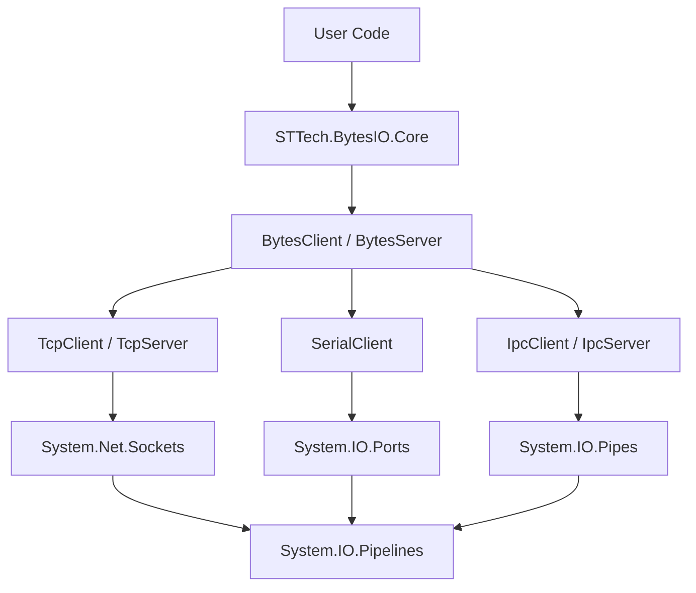

<h1 align="center">STTech.BytesIO</h1>

<p align="center">
  <strong>一个高性能、轻量级、统一API的 .NET 字节流通信框架。</strong>
</p>

<p align="center">
  <a href="https://github.com/landriesnidis/STTech.BytesIO/blob/main/LICENSE"></a>
  <a href="https://www.nuget.org/packages/STTech.BytesIO"></a>
  
</p>

---

## 🚀 简介 (Introduction)

**STTech.BytesIO** 是一个高性能、轻量级的 .NET 字节流通信框架。它为开发者提供了统一的编程模型，用于处理 TCP、串口 (SerialPort)、进程间通信 (IPC/NamedPipe) 以及 QUIC、P2P 等底层数据传输。

本框架深度集成了 `System.IO.Pipelines`，实现了高效的零拷贝数据处理模式，特别适用于工业自动化、物联网、高性能服务器等对通信稳定性与吞吐量有严苛要求的场景。

## ✨ 核心特性 (Key Features)

- **统一 API 架构**: 无论是 TCP、串口还是命名管道，均使用一致的 `Connect()`/`Send()`/`OnDataReceived` 模型，极大降低代码迁移成本，**“学会一个就等于学会所有”**。
- **卓越性能**:
  - ⚡ **零拷贝 (Zero-Copy)**: 基于 `System.IO.Pipelines` 优化接收缓冲管理，全面减少 GC 压力。
  - 🧵 **原生异步**: 全面采用 `async`/`await` 异步编程模型，提升系统并发响应能力。
- **工业级稳健性**:
  - 🔄 **自动重连**: 内置指数退避或自定义间隔的自动重连机制。
  - 💓 **多级心跳**: 支持双向心跳包发送与超时检测。
  - 📦 **协议解包 (Unpacker)**: 提供强大的封包/解包器，轻松解决粘包、半包问题。
- **高度可定制**: 支持 SSL/TLS 加密通信、自定义发送队列策略与优先级管理。
- **轻量化**: 仅引用官方维护的基础库，拒绝臃肿。

---

## 🛠️ 安装 (Installation)

通过 NuGet 包管理器安装核心库：

```bash
dotnet add package STTech.BytesIO
```

---

## 📖 快速上手 (Quick Start)

STTech.BytesIO 的最大优势在于 **API 的高度一致性**。这意味着无论您底层使用的是 TCP、串口、命名管道还是 QUIC，上层的收发逻辑完全相同。**学会使用一种客户端，就等于掌握了所有类型的客户端。**

### 1. 客户端初始化对比

各种通信方式的差异仅在于初始化和配置参数：

```csharp
// 🔌 TCP 客户端
var tcpClient = new TcpClient { Host = "127.0.0.1", Port = 8080 };

// 🔌 串口客户端
var serialClient = new SerialClient { PortName = "COM1", BaudRate = 9600 };

// 🔌 IPC (命名管道) 客户端
var ipcClient = new IpcClient { PipeName = "STTech.BytesIO.Demo" };

// 🔌 QUIC 客户端 (需引入 STTech.BytesIO.Quic 包)
var quicClient = new QuicClient { Port = 443 };
```

### 2. 统一的数据收发逻辑

无论您选择上述哪种客户端，收发数据的代码都是完全一样的（以 `tcpClient` 为例）：

```csharp
// 1. 订阅连接状态和异常事件
tcpClient.OnConnectedSuccessfully += (s, e) => Console.WriteLine("连接成功");
tcpClient.OnDisconnected += (s, e) => Console.WriteLine($"已断开连接: {e.ReasonCode}");
tcpClient.OnExceptionOccurs += (s, e) => Console.WriteLine($"发生异常: {e.Exception.Message}");

// 2. 订阅数据接收事件
tcpClient.OnDataReceived += (s, e) => 
{
    // ReceiveContext 支持零拷贝索引访问、LINQ 和大小端数值转换
    Console.WriteLine($"收到数据: {e.Data.ToArray().ToHexString()}");
};

// 3. 异步建立连接
var connectResult = await tcpClient.ConnectAsync();
if (connectResult.IsSuccess) 
{
    // 4. 统一的异步发送数据方式
    await tcpClient.SendAsync(new byte[] { 0x01, 0x02, 0x03 });
    await tcpClient.SendAsync("Hello STTech.BytesIO".GetBytes());
}
```

---

## 🏗️ 架构概览 (Architecture)



---

## 📦 官方扩展库与协议实现

为了应对更复杂的工业和网络场景，我们提供了官方维护的扩展包：

- 📖 **[STTech.BytesIO.Modbus](./STTech.BytesIO.Modbus/README.md)**: 
  基于 STTech.BytesIO 的全方位 Modbus RTU/TCP/ASCII 协议实现。**（协议特化实现，请点击查看单独的文档）**
- 🔌 **STTech.BytesIO.SerialPortStream**: 
  基于 `SerialPortStream` 的增强型跨平台串口通信实现，解决 Linux 环境和特殊串口驱动兼容性问题。
- 🌐 **STTech.BytesIO.Quic**: 
  基于最新 HTTP/3 核心 QUIC 协议的客户端/服务端实现。
- 🔗 **STTech.BytesIO.P2P**: 
  基于点对点网络的通信封装。

---

## ⚖️ 开源协议 (License)

本项目采用 [Apache-2.0](LICENSE) 协议开源。

## 🤝 贡献与支持 (Support)

- **提交问题**: [GitHub Issues](https://github.com/landriesnidis/STTech.BytesIO/issues)
- **技术博客**: [CSDN 专栏](https://blog.csdn.net/lgj123xj/category_11758698.html)
- **加入社区**: 点击上方 Gitter 徽章进入实时讨论组。

---
*Powered by KarFans Industrial Co., LTD.*
