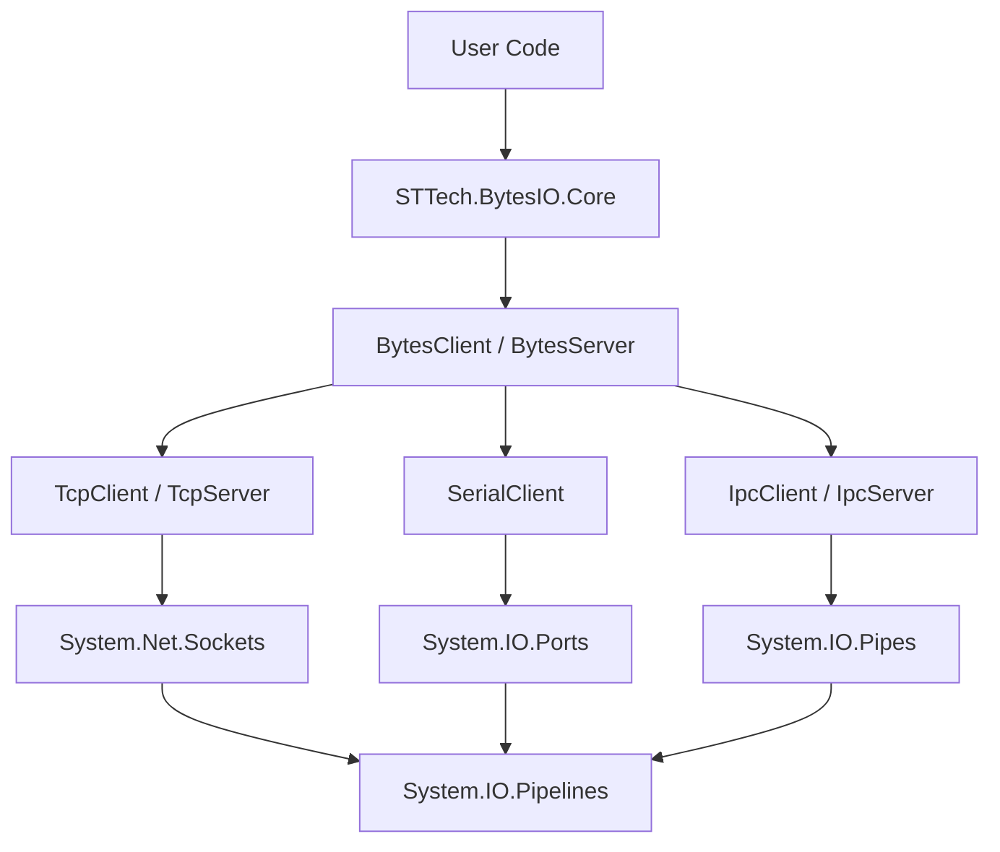

# STTech.BytesIO

<p align="center">
  
</p>

<p align="center">
  <a href="https://www.nuget.org/packages/STTech.BytesIO"></a>
  <a href="https://www.nuget.org/packages/STTech.BytesIO"></a>
  <a href="https://github.com/landriesnidis/STTech.BytesIO/blob/master/LICENSE"></a>
</p>

---

## 🚀 简介 (Introduction)

**STTech.BytesIO** 是一个高性能、轻量级的 .NET 字节流通信框架。它为开发者提供了统一的编程模型，用于处理 TCP、串口 (SerialPort) 和进程间通信 (IPC/NamedPipe) 等底层数据传输。

本框架深度集成了 `System.IO.Pipelines`，实现了高效的零拷贝数据处理模式，特别适用于工业自动化、物联网、高性能服务器等对通信稳定性与吞吐量有严苛要求的场景。

---

## ✨ 核心特性 (Key Features)

- **统一 API 架构**: 无论是 TCP、串口还是命名管道，均使用一致的 `Connect()`/`Send()`/`OnDataReceived` 模型，极大降低代码迁移成本。
- **卓越性能**:
  - ⚡ **零拷贝 (Zero-Copy)**: 基于 `System.IO.Pipelines` 优化接收缓冲管理，减少 GC 压力。
  - 🧵 **原生异步**: 全面采用 `async`/`await` 异步编程模型，提升系统并发响应能力。
- **工业级稳健性**:
  - 🔄 **自动重连**: 内置指数退避或自定义间隔的自动重连机制。
  - 💓 **多级心跳**: 支持双向心跳包发送与超时检测。
  - 📦 **协议解包 (Unpacker)**: 提供强大的封包/解包器，轻松解决粘包、半包问题。
- **高度可定制**:
  - 支持 SSL/TLS 加密通信。
  - 支持自定义发送队列策略与优先级管理。
- **轻量化**: 仅引用官方维护的基础库，拒绝臃肿。

---

## 🛠️ 安装 (Installation)

通过 NuGet 包管理器安装：

```bash
dotnet add package STTech.BytesIO
```

---

## 📖 快速上手 (Quick Start)

### 1. TCP 客户端 (TCP Client)

```csharp
var client = new TcpClient { Host = "127.0.0.1", Port = 8080 };

// 订阅接收数据事件
client.OnDataReceived += (s, e) => {
    Console.WriteLine($"收到数据: {BitConverter.ToString(e.Data)}");
};

// 建立连接
var result = await client.ConnectAsync();
if (result.IsSuccess) {
    // 发送数据
    await client.SendAsync(new byte[] { 0x01, 0x02, 0x03 });
}
```

### 2. 串口客户端 (Serial Client)

```csharp
var client = new SerialClient { PortName = "COM1", BaudRate = 9600 };
await client.ConnectAsync();
await client.SendAsync(Encoding.UTF8.GetBytes("Hello Device"));
```

### 3. IPC 命名管道 (IPC Client)

```csharp
var client = new IpcClient { PipeName = "MyTestPipe" };
await client.ConnectAsync();
```

---

## 🏗️ 架构概览 (Architecture)



---

## 📦 关联项目 (Extensions)

- **[STTech.BytesIO.Modbus](https://github.com/landriesnidis/STTech.BytesIO/tree/master/STTech.BytesIO.Modbus)**: 全方位的 Modbus RTU/TCP/ASCII 协议实现。

---

## ⚖️ 开源协议 (License)

本项目采用 [Apache-2.0](LICENSE) 协议开源。

## 🤝 贡献与支持 (Support)

- **提交问题**: [GitHub Issues](https://github.com/landriesnidis/STTech.BytesIO/issues)
- **技术博客**: [CSDN 专栏](https://blog.csdn.net/lgj123xj/category_11758698.html)
- **加入社区**: 点击上方 Gitter 徽章进入实时讨论组。

---
*Powered by KarFans Industrial Co., LTD.*
